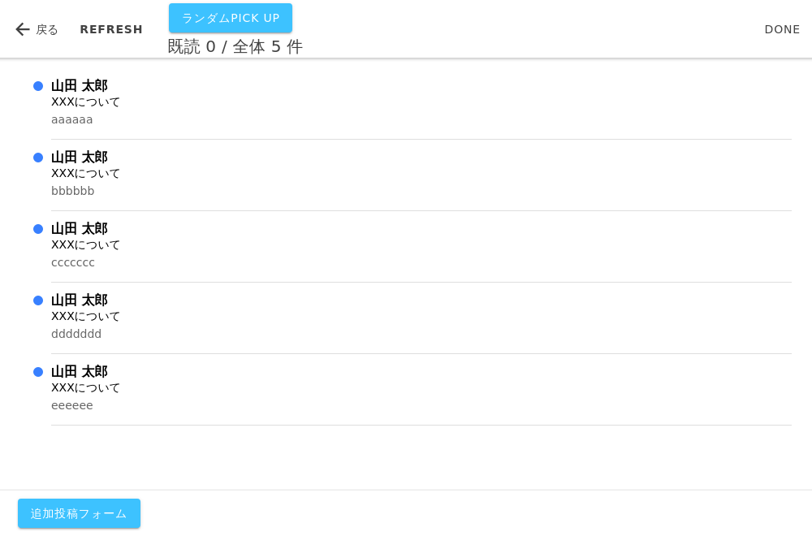

# yaminabe-app

## 実際の画面（Cypressのスクリーンショット）と使い方

1. 画面左下の追加投稿フォームボタンからテーマを投稿する
1. 集まったら画面上部のランダムPICK UPボタンで選択する
1. 話す

## テストの実行
- 結合テスト
    1. 開発コンテナでfrontディレクトリに移動する
    1. `npm run build`を実行し、distディレクトリを作成する。
    1. ビルド結果をもとに、次のコマンドを実行するとNGINX＋Cypressを起動する。`docker-compose -f integration-test-docker-compose.yml up `
